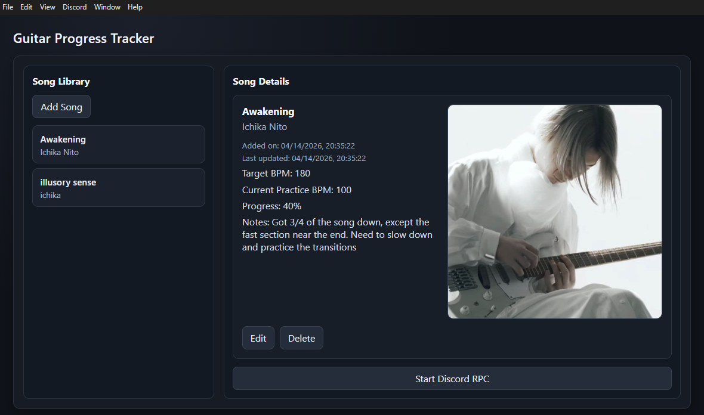

# Guitar Progress Tracker

Guitar Progress Tracker is a Windows desktop app for organizing songs, tracking practice progress, and optionally showing your current activity on Discord.

## Why Use It

- Keep a personal song library in one place
- Track practice goals and progress over time
- Store useful links, notes, and references per song
- Set and update song thumbnails for quick visual scanning
- Show active practice status on Discord (optional)

## Screenshot

## Main Features

- Song management: add, edit, and delete songs
- Practice tracking: progress percent, target BPM, current BPM
- Notes and links: keep tabs/recordings/resources attached to songs
- Thumbnail workflow: upload, preview, and update images
- Discord integration: configure app ID and activity update interval

## Install (Windows)

1. Go to the GitHub Releases page for this project.
2. Download the latest installer file ending in `.exe`.
3. Run the installer and follow the setup steps.
4. Launch Guitar Progress Tracker from Start Menu or desktop shortcut.

## Quick Start

1. Open the app.
2. Add your first song from the Add Song flow.
3. Fill in progress/BPM/notes as you practice.
4. Open Discord settings in the app if you want presence updates.

## Data and Privacy

- Your song data is stored locally on your machine.
- The app does not require cloud sync.
- Discord features are optional and only used when configured.

## Troubleshooting

If the app opens with a blank window:

1. Use the latest installer build from Releases.
2. Reinstall over the existing version.
3. If issue persists, open an issue with your app version and steps to reproduce.

## For Developers

Development setup, scripts, packaging flow, and release steps are documented in [docs/DEVELOPMENT.md](docs/DEV.md).

## License

This project is licensed under MIT. See [LICENSE](LICENSE).
